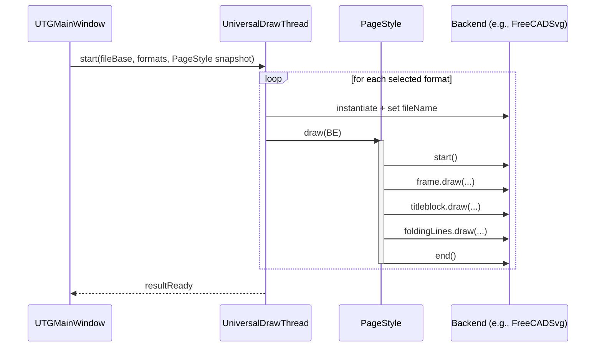

## Architecture and Logic Overview

This application generates drawing sheet templates for FreeCAD TechDraw and KiCAD (v8) with a unified visual style. It is built with Qt 6 and centers on a rendering abstraction that targets multiple output formats (SVG variants, KiCAD worksheet, PDF, PNG, HTML) from a single, shared page description.

### High‑level Flow

1) UI (UTGMainWindow)
- User selects page size/orientation, frame, title block, folding lines, font, and output formats.
- Live preview updates as settings change.
- On “Generate”, a background worker creates the selected files.

2) Page model (PageStyle)
- Encapsulates page layout (QPageLayout), selected PageFrame, TitleBlock, FoldingLines, and font/editable options.
- Has a single draw(into: UniversalDraw) function that renders the whole page in order.

3) Rendering abstraction (UniversalDraw + backends)
- A lightweight API with drawLine/drawRect/drawPoly/drawCircle/drawText/drawPicture, plus start()/end().
- Concrete backends translate those calls into specific file formats.

4) Outputs (UniversalDrawThread)
- Spawns a worker thread; for each selected format, instantiates the matching backend and asks PageStyle to draw into it.

### Core Concepts

- Units and coordinates: All drawing is specified in millimeters using QPageLayout/QRectF space. Orientation (portrait/landscape) is handled by QPageLayout.
- Page composition order: frame → title block → folding lines. The frame computes a “drawing area” used as the placement anchor for the title block.
- Text anchors: drawText supports vertical (Top/Middle/Bottom) and horizontal (Left/Center/Right) anchors; the FreeCAD and KiCAD backends use names to map editable variables.

### Main Components

UTGMainWindow (Src/Window)
- Owns UI and a PreView widget.
- Maintains shared instances of PageStyle, PageFrame, TitleBlock, FoldingLines.
- Reacts to UI changes (page size, orientation, frame, titleblock, language, folding lines, font) and calls updatePreView().
- On “Generate”, opens a target directory, builds a UniversalDrawThread with file base name and desired formats, and starts it.

PreView (Src/PreView)
- Custom QFrame that renders the current PageStyle using a Qt painter backend (QtPainterDrawer).
- Computes a uniform scale so the page fits the widget; then calls PageStyle::draw(). This produces a WYSIWYG preview without writing files.

PageStyle (Src/PageLayout)
- Holds the QPageLayout (size/orientation, zero margins), PageFrame, TitleBlock, FoldingLines, font, and the “show editable text” flag.
- draw(into):
	- Configures backend (page width/height and editable visibility), then into->start().
	- frame->draw(into, full page rect, layout) and sets the internal drawing area.
	- titleblock->draw(into, frame->drawingArea(), layout).
	- foldingLines->draw(into, layout).
	- into->end().

PageFrame (Src/PageLayout/Frame)
- Base class for page border and fixed graphics like centering marks.
- Maintains a drawingArea QRectF (the usable space inside the frame). Some frames can optionally avoid indenting into the drawing area.
- Implementations (e.g., ISO5457Frame, Plain) compute geometry and call UniversalDraw primitives.

TitleBlock (Src/PageLayout/TitleBlock)
- Base class for the title block region, placed relative to frame->drawingArea().
- Manages a language map (m_languageTexts) and current language key; concrete classes populate labels/texts.
- Implementations (ISO7200A/B, FreeCADA, Plain) draw labeled fields and editable text placeholders. Names are used to bind variables for FreeCAD/KiCAD.

FoldingLines (Src/PageLayout/FoldingLines)
- Base class for drawing fold marks to fold a page down to a target size (toWhat: QPageLayout).
- Provides helpers to draw vertical/horizontal pairs at given offsets.
- Implementations (DIN824ALike, DIN824CLike) compute fold positions and call the helpers.

UniversalDraw (Src/UniversalDraw)
- Abstract rendering API in millimeters with simple geometry and text primitives.
- Also carries the output file name, page width/height, and a showEditable flag.
- Backends implement the virtual methods to produce a real file:
	- FreeCADSvg: SVG tailored for FreeCAD TechDraw.
	- KiCAD8: KiCAD v8 worksheet .kicad_wks.
	- SvgDraw: plain SVG.
	- SvgQtPaint: SVG drawn via a Qt painter surface.
	- PdfQtPaint: PDF via Qt painter.
	- PngQtPaint: PNG via Qt painter.
	- HtmlDraw: HTML wrapper embedding SVG.

UniversalDrawThread (Src/Threads)
- Receives a base file name, PageStyle snapshot, and a list of DrawingFormate enums.
- For each format, instantiates the proper backend, sets the concrete file extension, and calls pageStyle.draw(backend).
- Emits resultReady when done.

Logging (Src/Utils)
- installQtLoggingHandler() wires a global Qt message handler so qDebug/qInfo/qWarning get consistent routing.

### Data and Variables

- Fonts: default "osifont"; can be changed in UI and propagated into frame/title block rendering.
- Editable text: PageStyle.showEditable controls whether editable fields are drawn in preview/exports that support it.
- Variable names: Backends map specific text field names to FreeCAD/KiCAD variables (see README Variable Docu table).

### Output Details

- File naming: The thread appends an extension per format (e.g., .freecad.svg, .ki8.kicad_wks, .qt.pdf, .svg, .qt.svg, .html, .qt.png).
- Units: All geometry is in millimeters; backends are responsible for any necessary unit conversion.
- Known limitations: See README (e.g., KiCAD 8 circles approximated by line arcs; FreeCAD SVG text height correction; Qt SVG/PDF quirks on Windows).

### Extensibility Guide

- New output format:
	1) Subclass UniversalDraw and implement the virtual draw* methods plus start()/end().
	2) Add an enum in DrawingFormate and a runX() method in UniversalDrawThread that creates the backend and calls PageStyle::draw().

- New frame:
	1) Subclass PageFrame; in draw(), compute drawingArea and render geometry via UniversalDraw.
	2) Register it in the UI (UTGMainWindow::initFrames) and handle selection in updateFrame().

- New title block:
	1) Subclass TitleBlock; populate language maps; implement draw() to place text/labels within titleBlockArea.
	2) Register in the UI (initTitleBlocks) and handle language options.

- New folding lines algorithm:
	1) Subclass FoldingLines; compute fold positions against onWhat and/or toWhat(); use drawVerFoldLine/drawHorFoldLine helpers.
	2) Register in UI (initFoldingLineAlgs) and selection handler.

### Typical Sequence

1) User changes options → UTGMainWindow updates m_pageStyle and calls PreView::update() → PreView renders PageStyle via QtPainterDrawer.
2) User clicks “Generate” → a directory is chosen → UniversalDrawThread starts → for each selected format, create backend, set file name, and call PageStyle::draw().

This design keeps UI, page composition, and output rendering decoupled, enabling consistent multi‑format generation and a reliable live preview.

## Diagrams

### Component overview

```mermaid
graph TD
	A[UTGMainWindow (UI)] -->|updates state| B[PageStyle]
	A -->|renders live| C[PreView]
	C --> D[QtPainterDrawer (UniversalDraw backend)]
	B -->|draw(frame)| E[PageFrame]
	B -->|draw(title block)| F[TitleBlock]
	B -->|draw(folding lines)| G[FoldingLines]
	A -->|Generate| H[UniversalDrawThread]
	H -->|for each format| I1[FreeCADSvg]
	H --> I2[KiCAD8]
	H --> I3[SvgDraw]
	H --> I4[SvgQtPaint]
	H --> I5[PdfQtPaint]
	H --> I6[PngQtPaint]
	H --> I7[HtmlDraw]
	subgraph Rendering Abstraction
		D
		I1
		I2
		I3
		I4
		I5
		I6
		I7
	end
```

### Sequence: Generate outputs



## Variable mappings (FreeCAD and KiCAD)

This section summarizes how text field names map to variables/attributes in each backend. All coordinates and sizes are in millimeters.

### Field names recognized by both the UI and backends

- SheetNumberNumbers
- SheetNumber
- NumberOfPages
- LegalOwner
- DateOfIssue
- RevisionIndex (KiCAD only)
- Title
- Scale (FreeCAD only)
- Creator (FreeCAD only)

### FreeCAD (FreeCADSvg)

- Editable fields: text elements get freecad:editable="<name>".
- Autofill mapping (freecad:autofill):
	- SheetNumberNumbers → sheet
	- SheetNumber → page_number
	- NumberOfPages → page_count
	- LegalOwner → organization
	- DateOfIssue → date
	- Title → title
	- Scale → scale
	- Creator → author
- Others: If a field name isn’t in the list above but isEditable=true, it’s still editable (freecad:editable set) without autofill.
- Text baseline: Vertical positioning adjusts by text size for Top/Middle anchors; horizontal alignment uses SVG text-anchor (start/middle/end).
- Font size: A correction factor is applied (size × (1 + 7/18)) to match FreeCAD TechDraw’s visual height.

### KiCAD v8 (KiCAD8)

- Built-in variables mapping:
	- SheetNumberNumbers → ${#}/${##}
	- SheetNumber → ${#}
	- NumberOfPages → ${##}
	- LegalOwner → ${COMPANY}
	- DateOfIssue → ${ISSUE_DATE}
	- RevisionIndex → ${REVISION}
	- Title → ${TITLE}
- Other editable fields: If isEditable=true and the name isn’t a known keyword, the text becomes ${<name>} so users can bind it via KiCAD’s variables (project/page/custom). Otherwise, literal text is written.
- Justification: Anchor combinations map to KiCAD’s (justify ...) options, e.g. Left/Top → (justify top), Center/Middle → (justify center), Right/Bottom → (justify right bottom), etc.
- Baseline tweak: The y position is offset by +0.3 mm to align with KiCAD’s baseline behavior.

### Plain SVG (SvgDraw) and Preview (QtPainterDrawer)

- Plain SVG: When isEditable=true and showEditable=false, editable text is skipped to mimic “empty” templates. Otherwise, text is drawn with SVG anchors. No special variable substitution.
- Preview (QtPainterDrawer): Renders all text; if editableBlue=true (used for preview), editable text is colored blue for visibility. Anchors are simulated by precomputing offsets with font metrics.

### Practical tips

- Prefer the standard names above to get the best cross-tool autofill behavior.
- For custom fields intended for KiCAD, keep names alphanumeric and consistent; they’ll be inserted as ${Name} and can be populated via project/page variables.
- For FreeCAD-only data (e.g., Creator, Scale), rely on the FreeCADSvg autofill.

